# Metaobject definitions

Two metaobject types back this build. Both are created in
**Settings → Custom data → Metaobjects** on the dev store (or via the
Admin GraphQL API / `shopify app` tooling — not theme code, metaobject
*definitions* aren't part of the theme filesystem, only their usage in
Liquid is).

Reasoning for why these two are metaobjects and not blocks or product
metafields is in [Architecture.md](Architecture.md#best-selling-combos-combos)
and [Architecture.md](Architecture.md#reviews-rail-reviews).

```mermaid
erDiagram
    COMBO ||--|| PRODUCT : "bundle_product (price source)"
    COMBO }o--o{ PRODUCT : "components (2-5, thumbnails)"
    TESTIMONIAL |o--o| PRODUCT : "product (optional)"

    COMBO {
        text name
        text description
        product_ref bundle_product
        product_ref_list components
        text flag "optional"
    }
    TESTIMONIAL {
        text quote
        text headline "optional"
        integer rating "1-5"
        text author
        text detail "optional"
        product_ref product "optional"
    }
```

## `combo`

Type handle: `combo`

| Field | Key | Type | Notes |
|---|---|---|---|
| Name | `name` | Single line text | e.g. "Kitchen essentials" |
| Description | `description` | Multi-line text | "Includes: Foaming Kitchen Cleaner, Dishwash Gel & Tap Cleaner…" |
| Bundle product | `bundle_product` | Product reference | The real sellable product for this combo — its `price` / `compare_at_price` drive every number shown on the card. Required. |
| Component products | `components` | List of product references | Products whose thumbnails/labels populate the "stack" preview (2–5 entries). |
| Flag | `flag` | Single line text | Optional, e.g. "Most popular" / "Best value". Blank renders no flag. |

Card rendering pulls price, compare-at, and savings **only** from
`bundle_product` — never store a price or a saving as metaobject text, or
it goes stale the moment the underlying product's price changes.

## `testimonial`

Type handle: `testimonial`

| Field | Key | Type | Notes |
|---|---|---|---|
| Quote | `quote` | Multi-line text | Required. |
| Headline | `headline` | Single line text | e.g. "Works like a charm" — optional, falls back to hiding the line. |
| Rating | `rating` | Integer (1–5) | Validated range in the metaobject definition. |
| Author name | `author` | Single line text | Required. |
| Author detail | `detail` | Single line text | e.g. "Laundry detergent" or "Verified buyer" — optional. |
| Related product | `product` | Product reference | Optional — if set, the card can link to the product; not required for display. |

## Why not product metafields for either

Neither combo nor testimonial data is a property *of a single product* —
a combo spans several products and owns its own sellable product; a
testimonial isn't about one product's attributes, it's standalone
marketing content that may reference a product. Metaobjects are the
correct shape for "structured content with its own identity, reused
across places," which is exactly Shopify's own guidance for when to reach
for them over metafields.

## Definitions as they'll actually be created

Metaobject definitions are store configuration, not theme files, so they
can't be "committed" the way Liquid can. This file is the source of truth
for what to create in the Admin, and the field keys here are the exact
keys the section/snippet Liquid expects — keep them in sync if either
changes.
