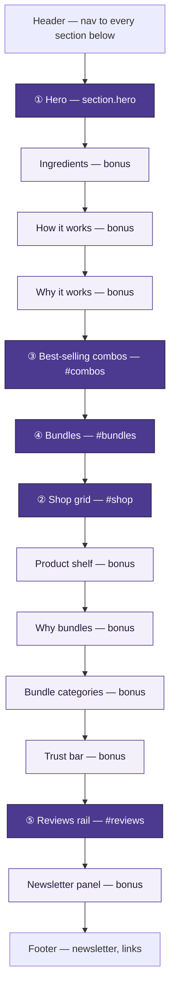
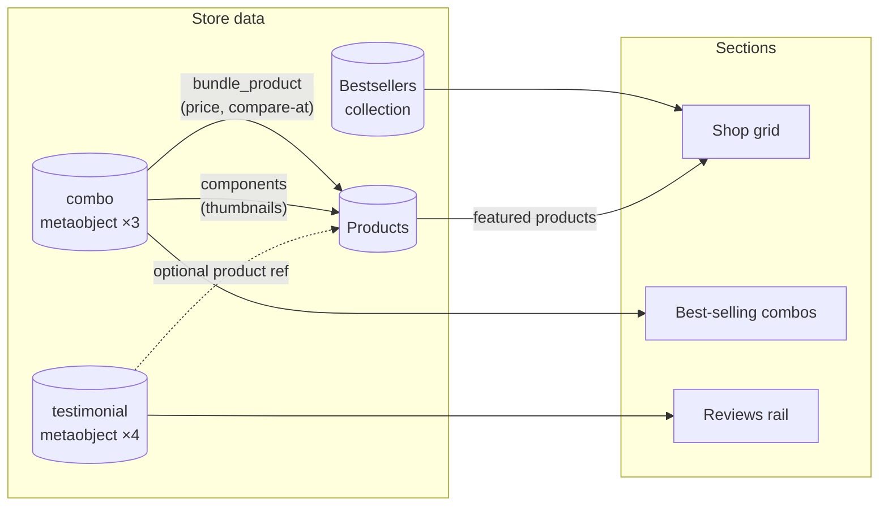

# Purelane — Shopify homepage

Production Shopify build of the Purelane plant-based homecare homepage,
for the Troopod AI Product Engineer assignment. Built on a clean Dawn
15.5.0 install; `reference/purelane-homepage.html` is the original
single-file prototype, kept for comparison — not the spec. See
[Architecture.md](Architecture.md) for what that means in practice, and
[Tradeoffs.md](Tradeoffs.md) for exactly what in the prototype didn't
survive contact with production (cart, search, account, add-to-cart were
all decorative there — real here).

**Live now:** `https://purelane-jt05iiqz.myshopify.com` (password
`troopod2026`) — the theme below is the store's actual published theme,
not a preview link.

## Page structure



Every box is its own real Shopify section — independently addable,
removable, and reorderable in the theme editor without breaking the ones
around it. The five required sections (①–⑤) are the assignment's scope;
everything else is additional, built to the same standard, easy to delete
if you only want the required five. Section order (and the light mint
color palette) was corrected to match `reference/purelane-homepage.html`'s
own real rendered design — see [Tradeoffs.md](Tradeoffs.md) for the
root-cause writeup.

| # | Section | id | File |
|---|---|---|---|
| ① | Hero | `#hero-{id}` | `sections/hero.liquid` |
| — | Ingredients *(bonus)* | `#ingredients` | `sections/ingredients.liquid` |
| — | How it works *(bonus)* | `#how-it-works` | `sections/how-it-works.liquid` |
| — | Why it works *(bonus)* | `#why-it-works` | `sections/why-it-works.liquid` |
| ③ | Best-selling combos | `#combos` | `sections/combos.liquid` |
| ④ | Bundles | `#bundles` | `sections/bundles.liquid` |
| ② | Shop / product grid | `#shop` | `sections/shop.liquid` |
| — | Product shelf *(bonus)* | `#product-shelf` | `sections/product-shelf.liquid` |
| — | Why bundles *(bonus)* | `#why-bundles` | `sections/why-bundles.liquid` |
| — | Bundle categories *(bonus)* | `#bundle-categories` | `sections/bundle-categories.liquid` |
| — | Trust bar *(bonus)* | `#trust-bar` | `sections/trust-bar.liquid` |
| ⑤ | Reviews rail | `#reviews` | `sections/reviews-rail.liquid` |
| — | Newsletter panel *(bonus)* | `#newsletter-panel` | `sections/newsletter-panel.liquid` |

Reusable pieces shared across all thirteen: `snippets/icon.liquid`,
`snippets/price-tag.liquid`, `snippets/section-heading.liquid`,
`snippets/badge-list.liquid`, `assets/purelane-shared.css` (the `.pl-surface`
glass-card treatment and `.pl-tilt` hover depth every card in the build
shares). The product shelf reuses `combos.liquid`'s `slider-component`
pattern; why-bundles and bundle-categories reuse `how-it-works.liquid`'s
icon+heading+body block pattern; the newsletter panel reuses Dawn's real
`` mechanism already proven in the footer — none of
the five new sections invent a new pattern from scratch.

Two more pieces sit outside the section list above because they're
page-furniture, not homepage sections:

- **Marquee bar** (`sections/marquee-bar.liquid`, lives in the header
  group) — a real continuous-scroll ticker, not Dawn's stock fade/slide
  announcement bar. Same CSS technique the reference itself uses: the
  message list renders twice in one flex track, `translateX(-50%)` loops
  it seamlessly, `prefers-reduced-motion` turns it off.
- **Scroll rail** (`snippets/scroll-rail.liquid` + `assets/scroll-rail.js`,
  rendered from `layout/theme.liquid` on the homepage only) — the
  fixed-position right-side dot rail, built from the *live DOM* at
  runtime instead of a hardcoded anchor list. It reads whatever sections
  actually exist inside `#MainContent`, in whatever order they're
  actually in, and labels each dot from that section's own heading — so
  reordering or removing a section in the theme editor never leaves a
  dangling dot pointing nowhere.

## Content model

Nothing below is typed into Liquid as a string. Prices, images, and copy
that a merchant would want to change all come from real Shopify objects —
products, a collection, or one of two metaobject types.



See [Metaobjects.md](Metaobjects.md) for exact field definitions and
[Architecture.md](Architecture.md) for the reasoning behind each
theme-setting-vs-block-vs-metafield-vs-metaobject call.

## Dev store

- URL: `https://purelane-jt05iiqz.myshopify.com`
- Storefront password: `troopod2026`
- Theme: **"Purelane (dev)" — published, live.** (It wasn't, initially —
  the build was correct but never made the store's active theme, which
  would have meant the URL above showed stock Horizon instead. Caught and
  fixed; see [AI-Workflow.md](AI-Workflow.md).)

Seeded with 11 products (8 core + 3 combo bundle products), including the
required sold-out (Herbal Floor Cleaner), no-image (Gentle Hydrating
Liquid Handwash), and extremely-long-title (Plant-Based Multi-Surface
Concentrate Cleaner…) cases. A "Bestsellers" collection groups the 8 core
products for the shop grid.

## Content wiring

| What | Wired to |
|---|---|
| Shop section's Collection | Bestsellers |
| Hero featured product blocks (3) | Foaming Kitchen Cleaner, Tap Cleaner & Limescale Remover, Copper Bronze & Brass Cleaner — real price + image, real discount badge |
| Combo blocks (3) | Kitchen essentials, Complete home bundle, Hard water solution kit |
| Testimonial blocks (4) | Anita, Priya, Sunita, Rohit S. |
| Bundle tiers (4) | Starter (2), Most popular (3), Whole home (5), Bulk stock-up (7) |
| Product shelf's Collection | Bestsellers (same 8 products, horizontal strip) |
| Announcement bar (4 messages) | Real, rotating — shipping, ingredients, review count, an actual bundle price |
| Main nav | Home, Catalog, Contact, Ingredients, How it works, Shop, Combos, Bundles, Reviews |

None of this is required for the page to render correctly — every section
has a real, intentional empty state if a picker is ever cleared. It's
wired because a merchant demoing this store shouldn't see empty states by
default.

## Cart, checkout and customer accounts

- **Cart:** drawer mode (`cart_type: "drawer"` in
  `config/settings_data.json`), a new light `scheme-7` on the cart page
  instead of Dawn's flat white default. Verified live end-to-end:
  add-to-cart opens the drawer, updates the header count, and quantity/
  remove run over AJAX on the cart page.
- **Search:** Dawn's real predictive search — verified live, returns
  actual product matches while typing.
- **Account:** this store uses Shopify's newer hosted **Customer
  Accounts** (`/account` redirects to `shopify.com/<id>/account`, entirely
  outside theme code — confirmed by visiting it, not assumed).
  `templates/customers/*.json` render nothing there. Branding for that
  surface, plus checkout, lives in **Settings → Customer accounts →
  Configurations → Edit → branding icon** — set to the same brand purple
  and Outfit/Inter fonts, just not through theme code.
- **Newsletter:** Dawn's unmodified `` in the footer.
  Tested live with a throwaway email, confirmed a real `Subscribed`
  customer record in Admin, then deleted the test record.

## Local development

```
npm install -g @shopify/cli
shopify theme dev --store=purelane-jt05iiqz.myshopify.com
```

`shopify theme check` reports 0 errors (8 pre-existing Dawn warnings, none
introduced by this build — verified after every change, 181 files
inspected).

## Documentation

| Doc | Covers |
|---|---|
| [Architecture.md](Architecture.md) | Data model decisions (theme setting vs. block vs. metafield vs. metaobject), reusable snippets, why the prototype's cross-section background system was replaced |
| [Metafields.md](Metafields.md) / [Metaobjects.md](Metaobjects.md) | Exact field definitions and why each exists |
| [Tradeoffs.md](Tradeoffs.md) | What was cut or changed from the prototype and why, including every piece of the prototype that looked interactive but wasn't (cart, account, search, reviews, add-to-cart) |
| [Future-Improvements.md](Future-Improvements.md) | What's next with more time, and which items turned out to be quick fixes vs. genuine platform gates (currency needs a real Shopify Payments account) |
| [QA-Checklist.md](QA-Checklist.md) | Section-by-section verification against real store data, plus a site-wide functionality table (cart, search, account, newsletter, nav) |
| [Accessibility-Report.md](Accessibility-Report.md) | Keyboard, focus, contrast, reduced motion, and the real bugs a self-review pass found |
| [Performance-Notes.md](Performance-Notes.md) | Image loading, CSS/JS scope, layout stability, and real (if partial) Navigation Timing measurements |
| [AI-Workflow.md](AI-Workflow.md) | What was delegated, where it broke, what I'd systematize for twenty more of these |

## Git history

Commits are organized by milestone (architecture → snippets → each
section → template wiring → fixes → docs), not squashed — `git log
--oneline` reads as the build order.

## Lessons learned

- **Theme editor stability is a feature, not a checkbox.** It's easy to
  write a section that looks right once and quietly breaks the moment a
  merchant adds a block, clears a picker, or drags a section somewhere
  else. Every empty state, every block-count assumption, and eventually
  section-level reorder itself had to be tested against that, not just
  reasoned about — see [QA-Checklist.md](QA-Checklist.md).
- **A screenshot proves a button exists, not that it's clickable.** The
  Bundles section shipped with three CTAs rendering correctly and doing
  nothing (`aria-disabled`, no `href`) because the seeded content was
  blank — caught by a user actually clicking one, not by a full visual
  pass. Since then, "click every interactive element" is a real QA step,
  not an assumption that render-correctly implies works.
- **AI accelerates writing code, not verifying it.** Every claim in this
  repo that matters — contrast ratios, keyboard order, cart behavior,
  which platform surfaces the theme actually controls — was checked
  against the live store, not asserted from reading the Liquid. The
  places this build is strongest are the places something was actually
  clicked, measured, or fetched; the places it's weakest (no Lighthouse
  score, no screen-reader pass) are exactly the ones no amount of code
  reading could have closed — see [AI-Workflow.md](AI-Workflow.md).
- **Reusable architecture pays for itself immediately, not eventually.**
  `price-tag.liquid`, `section-heading.liquid`, and `.pl-surface` weren't
  written for hypothetical future sections — they were written because
  the second section needed the same thing the first one did, and the
  third confirmed it wasn't a coincidence.
